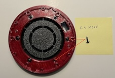
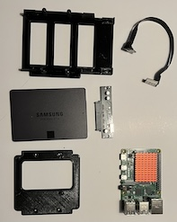
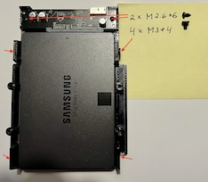
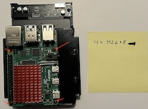
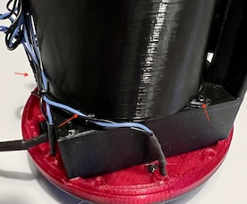
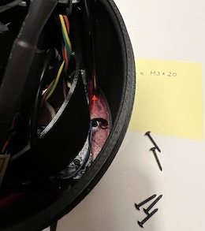
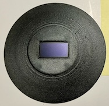

1. Base and feet 
2. LED ring 
3. Fan 1 
4. Fan 2 
5. Harness 1 
6. Harness 2 
7. HDD and Raspi 
8. HDD 
9. Raspi plate 
10. Raspi 
11. Raspi 
12. Temp sensor 
13. Temp sensor 
14. All together 
15. All together 
16. Air cover 
17. Air cover 
18. Air cover and harness 
19. USB cables routing 
20. USB for HDD 
21. Install main case 
22. Main case screws 
23. Install OLED 
24. OLED from the top 
25. OLED cable 
26. Top cover 
